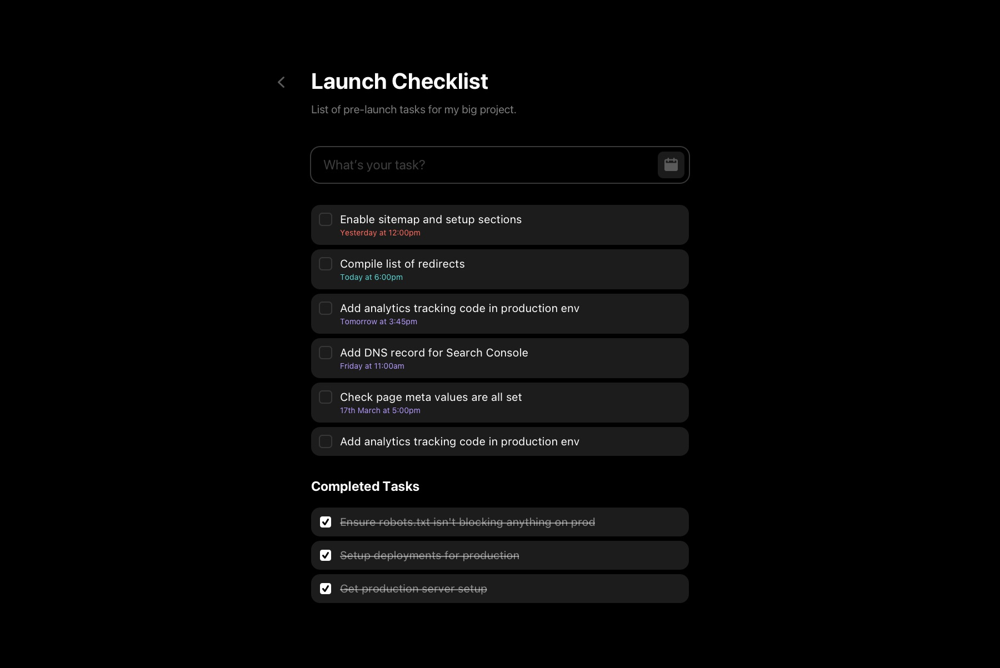

# Tasks Task
A test to see if you can code.  
Requires [Docker](https://docker.com) and [Node](https://nodejs.org).

## Goal
Add due dates to tasks.

### Steps
Here's a rough guide for what you need to do:
 
- Add a due date column to the `tasks` table. This should be non-destructive, so 
  don't drop the table.
- Add a date picker (any will do, as long as it fits the look of the app) to the
  task input according to the design.
- Display due dates on tasks as per the design, and have it change appearance 
  depending on whether it is upcoming, due soon, or late.

## Setup

### API
In `api` directory:

1. Copy `.env.example` into `.env`
1. Install node modules `$ yarn install`
1. Start docker containers `$ docker-compose up -d`
1. Migrate the schema `$ make migrate`

### Web
In `web` directory:

1. Install docker modules `$ yarn install`
1. Start development server `$ yarn start`
  
## Useful Links

- Adminer: https://localhost:5002/
- GraphiQL: http://localhost:5001/graphiql
- Web UI: http://localhost:3000/

## Design

#### Main


#### Compose Task


## Resources
### Colours
- <span style="display:inline-block;margin-bottom:2px;font-family:SFMono-Regular,monospace;background:#FF6B5E;padding:2px 5px;border-radius:3px;color:#000">#FF6B5E</span> - Overdue
- <span style="display:inline-block;margin-bottom:2px;font-family:SFMono-Regular,monospace;background:#5BD8D6;padding:2px 5px;border-radius:3px;color:#000">#5BD8D6</span> - Due Soon
- <span style="display:inline-block;margin-bottom:2px;font-family:SFMono-Regular,monospace;background:#B59BFF;padding:2px 5px;border-radius:3px;color:#000">#B59BFF</span> - Upcoming / Button
- <span style="display:inline-block;margin-bottom:2px;font-family:SFMono-Regular,monospace;background:#6F57B4;padding:2px 5px;border-radius:3px;color:#fff">#6F57B4</span> - Icon

### Assets
<div style="display:flex">
  <svg xmlns="http://www.w3.org/2000/svg" width="24" height="24" viewBox="0 0 24 24" style="vertical-align:middle;margin:-1px 10px 0 0">
    <path fill="#6F57B4" d="M657,21.5714286 L654.428571,21.5714286 L654.428571,20.2857143 C654.428571,19.5756339 653.852938,19 653.142857,19 C652.432777,19 651.857143,19.5756339 651.857143,20.2857143 L651.857143,21.5714286 L644.142857,21.5714286 L644.142857,20.2857143 C644.142857,19.5756339 643.567223,19 642.857143,19 C642.147062,19 641.571429,19.5756339 641.571429,20.2857143 L641.571429,21.5714286 L639,21.5714286 C637.343929,21.573318 636.001889,22.9153576 636,24.5714286 L636,40 C636.001889,41.656071 637.343929,42.9981106 639,43 L657,43 C658.656071,42.9981106 659.998111,41.656071 660,40 L660,24.5714286 C659.998111,22.9153576 658.656071,21.573318 657,21.5714286 Z M638.571429,24.5714286 C638.571429,24.3347351 638.763307,24.1428571 639,24.1428571 L641.571429,24.1428571 L641.571429,25.4285714 C641.571429,26.1386518 642.147062,26.7142857 642.857143,26.7142857 C643.567223,26.7142857 644.142857,26.1386518 644.142857,25.4285714 L644.142857,24.1428571 L651.857143,24.1428571 L651.857143,25.4285714 C651.857143,26.1386518 652.432777,26.7142857 653.142857,26.7142857 C653.852938,26.7142857 654.428571,26.1386518 654.428571,25.4285714 L654.428571,24.1428571 L657,24.1428571 C657.236693,24.1428571 657.428571,24.3347351 657.428571,24.5714286 L657.428571,28 C657.428571,28.2366935 657.236693,28.4285714 657,28.4285714 L639,28.4285714 C638.763307,28.4285714 638.571429,28.2366935 638.571429,28 L638.571429,24.5714286 Z" transform="translate(-636 -19)"/>
  </svg>
  Calendar Icon
</div>

```svg
<svg xmlns="http://www.w3.org/2000/svg" width="24" height="24" viewBox="0 0 24 24">
  <path fill="#6F57B4" d="M657,21.5714286 L654.428571,21.5714286 L654.428571,20.2857143 C654.428571,19.5756339 653.852938,19 653.142857,19 C652.432777,19 651.857143,19.5756339 651.857143,20.2857143 L651.857143,21.5714286 L644.142857,21.5714286 L644.142857,20.2857143 C644.142857,19.5756339 643.567223,19 642.857143,19 C642.147062,19 641.571429,19.5756339 641.571429,20.2857143 L641.571429,21.5714286 L639,21.5714286 C637.343929,21.573318 636.001889,22.9153576 636,24.5714286 L636,40 C636.001889,41.656071 637.343929,42.9981106 639,43 L657,43 C658.656071,42.9981106 659.998111,41.656071 660,40 L660,24.5714286 C659.998111,22.9153576 658.656071,21.573318 657,21.5714286 Z M638.571429,24.5714286 C638.571429,24.3347351 638.763307,24.1428571 639,24.1428571 L641.571429,24.1428571 L641.571429,25.4285714 C641.571429,26.1386518 642.147062,26.7142857 642.857143,26.7142857 C643.567223,26.7142857 644.142857,26.1386518 644.142857,25.4285714 L644.142857,24.1428571 L651.857143,24.1428571 L651.857143,25.4285714 C651.857143,26.1386518 652.432777,26.7142857 653.142857,26.7142857 C653.852938,26.7142857 654.428571,26.1386518 654.428571,25.4285714 L654.428571,24.1428571 L657,24.1428571 C657.236693,24.1428571 657.428571,24.3347351 657.428571,24.5714286 L657.428571,28 C657.428571,28.2366935 657.236693,28.4285714 657,28.4285714 L639,28.4285714 C638.763307,28.4285714 638.571429,28.2366935 638.571429,28 L638.571429,24.5714286 Z" transform="translate(-636 -19)"/>
</svg>
```

### Sizes
- Calendar border radius: `10px`
- Calendar button padding: `12px`
- Due date size: `14px`

### SASS
This project uses SASS (but we also use LESS on older projects). This project 
uses a helper function `size()` to convert `px` to `rem`.
